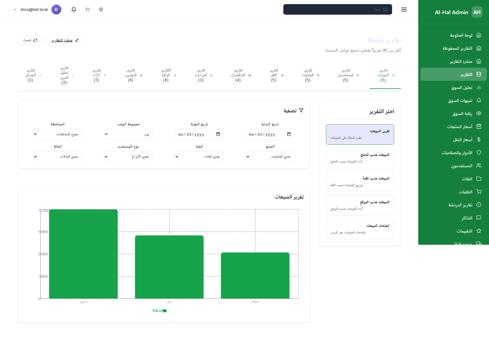
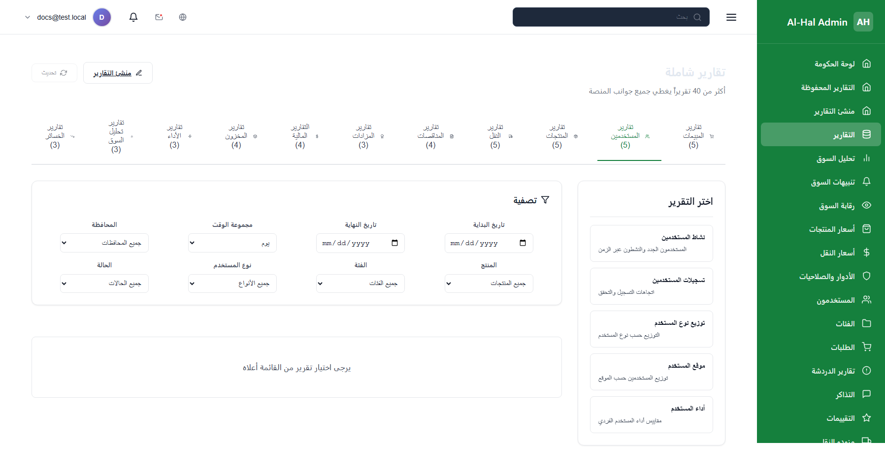
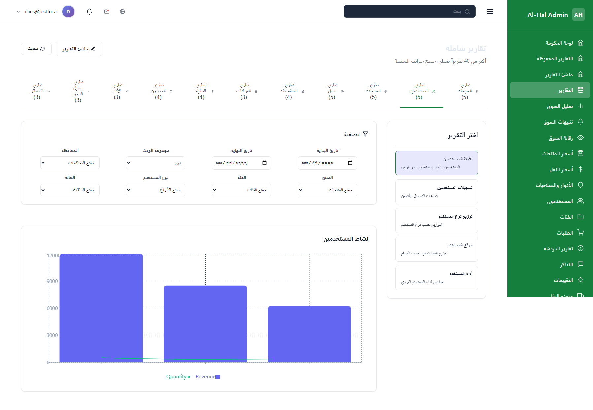
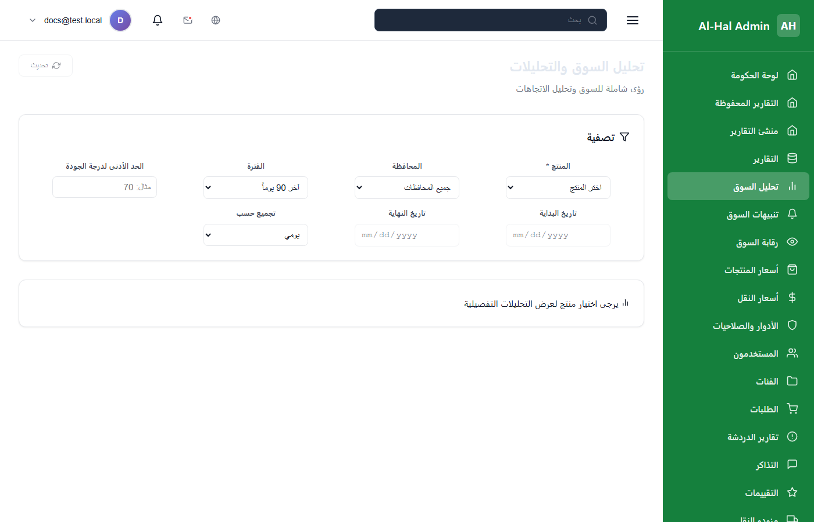
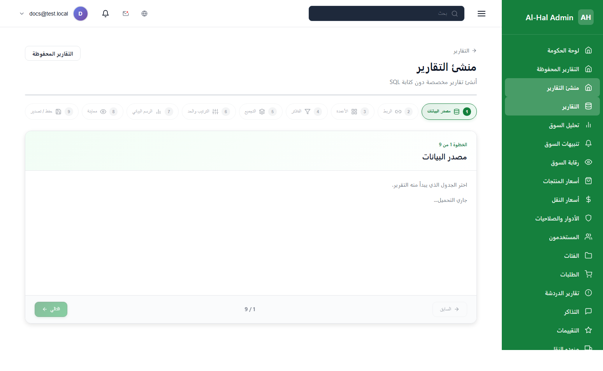
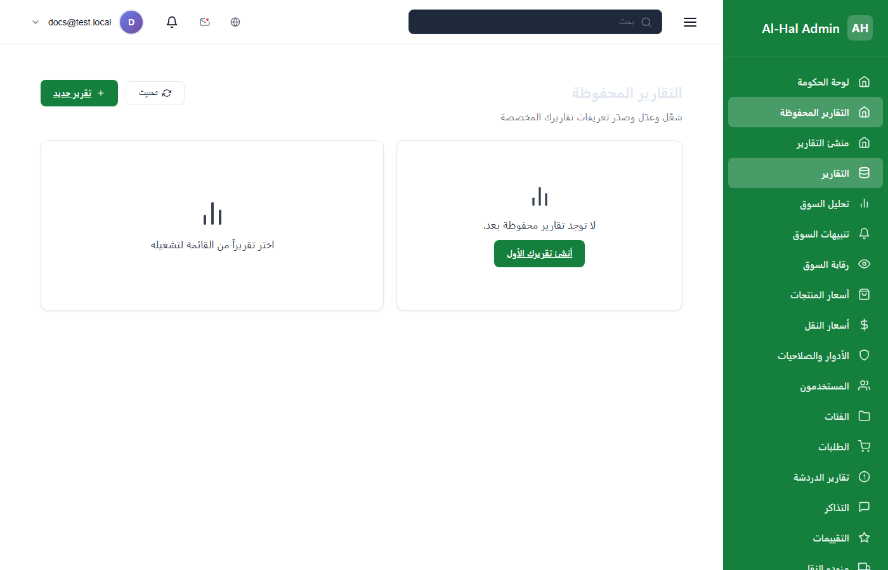
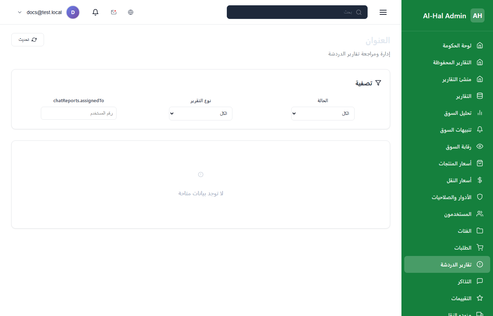

# دليل التقارير الشامل — لوحة تحكم Al-Hal Admin

> **تاريخ الإعداد:** 30 أيار 2026  
> **الحالة:** نسخة أولية — تتطلب اختبار API بالمصادقة الكاملة لإكمال لقطات الشاشة الحقيقية

---

## ملخص تنفيذي

تحتوي المنصة على **6 أنظمة تقارير** مستقلة:

| # | النظام | المسار | عدد التقارير | الصلاحية المطلوبة |
|---|--------|--------|-------------|-------------------|
| 1 | التقارير الشاملة | `/reports` | 44 تقريراً | `gov.reports.view` |
| 2 | تحليل السوق | `/analytics` | 7 مخططات | `gov.market_analysis.view` |
| 3 | منشئ التقارير | `/reports/builder` | مخصص (SQL-like) | `gov.reports.build` |
| 4 | التقارير المحفوظة | `/reports/saved` | حسب المستخدم | `gov.reports.build` |
| 5 | تقارير الدردشة | `/chat-reports` | 5 أنواع بلاغ | `admin` / `superadmin` |
| 6 | تحليلات الموبايل | `/mobile-analytics` | إحصائيات التطبيق | `admin` / `superadmin` |

**إجمالي التقارير الثابتة في `/reports`:** 44  
**تقارير API إضافية (وزارة + إحصاء — غير معروضة في الواجهة حالياً):** 12

---

## لقطات الشاشة

تم التقاط لقطات توضيحية (ببيانات تجريبية) في المجلد:

```
docs/reports-screenshots/
```

| الملف | المحتوى |
|-------|---------|
| `00-reports-overview.png` | صفحة التقارير الشاملة — نظرة عامة |
| `category-sales.png` | تبويب تقارير المبيعات |
| `report-sales-sample.png` | مثال: تقرير المبيعات مع مخطط |
| `category-users.png` | تبويب تقارير المستخدمين |
| `report-users-sample.png` | مثال: نشاط المستخدمين |
| `category-products.png` | تبويب تقارير المنتجات |
| `report-products-sample.png` | مثال: أداء المنتج |
| `category-transport.png` | تبويب تقارير النقل |
| `report-transport-sample.png` | مثال: نشاط النقل |
| `category-financial.png` | تبويب التقارير المالية |
| `report-financial-sample.png` | مثال: تقرير الإيرادات |
| `analytics-page.png` | صفحة تحليل السوق |
| `report-builder.png` | منشئ التقارير |
| `saved-reports.png` | التقارير المحفوظة |
| `chat-reports.png` | تقارير الدردشة |

> **ملاحظة:** بعد إصلاح مشاكل API (انظر القسم الأخير)، يُعاد التقاط اللقطات ببيانات حقيقية من السيرفر.

---

## 1. التقارير الشاملة (`/reports`)

**الغرض:** لوحة مركزية لأكثر من 40 تقريراً تغطي المبيعات، المستخدمين، المنتجات، النقل، المناقصات، المزادات، المالية، المخزون، الأداء، السوق، والخسائر.

**الفلاتر المتاحة:** تاريخ البداية/النهاية، تجميع زمني (دقيقة → سنة)، المحافظة، المنتج، الفئة، نوع المستخدم، الحالة.


---

### 1.1 تقارير المبيعات (5)


| التقرير | API | لماذا يُستخدم | مثال |
|---------|-----|--------------|------|
| **تقرير المبيعات** | `GET /api/reports/sales` | نظرة شاملة على حجم المبيعات والإيرادات والمعاملات | بطاقات ملخص + مخطط زمني للإيرادات |
| **المبيعات حسب المنتج** | `GET /api/reports/sales/by-product` | معرفة المنتجات الأكثر مبيعاً وربحيتها | مخطط أعمدة: بندورة 12,000 / خيار 8,500 |
| **المبيعات حسب الفئة** | `GET /api/reports/sales/by-category` | توزيع المبيعات بين فئات (خضار، فواكه...) | مخطط دائري + أعمدة |
| **المبيعات حسب الموقع** | `GET /api/reports/sales/by-location` | أداء المبيعات جغرافياً حسب المحافظة/المنطقة | مخطط أعمدة حسب المحافظة |
| **اتجاهات المبيعات** | `GET /api/reports/sales/trends` | تتبع نمو/انخفاض المبيعات عبر الزمن | مخطط خط/مساحة شهري |



---

### 1.2 تقارير المستخدمين (5)



| التقرير | API | لماذا يُستخدم |
|---------|-----|--------------|
| **نشاط المستخدمين** | `GET /api/reports/users/activity` | عدد المستخدمين الجدد والنشطين يومياً/شهرياً |
| **تسجيلات المستخدمين** | `GET /api/reports/users/registrations` | اتجاهات التسجيل ومعدلات التحقق |
| **توزيع نوع المستخدم** | `GET /api/reports/users/by-type` | نسب المزارعين/التجار/الناقلين/المشترين |
| **موقع المستخدم** | `GET /api/reports/users/by-location` | انتشار المستخدمين جغرافياً |
| **أداء المستخدم** | `GET /api/reports/users/performance` | مقاييس أداء فردية (مبيعات، طلبات...) |



---

### 1.3 تقارير المنتجات (5)

| التقرير | API | لماذا يُستخدم |
|---------|-----|--------------|
| **أداء المنتج** | `GET /api/reports/products/performance` | مقارنة أداء المبيعات بين المنتجات |
| **مخزون المنتج** | `GET /api/reports/products/inventory` | مستويات المخزون الحالية لكل منتج |
| **اتجاهات أسعار المنتجات** | `GET /api/reports/products/price-trends` | تغير الأسعار عبر الزمن |
| **أفضل المنتجات** | `GET /api/reports/products/top` | Top N منتجات حسب الإيراد أو الكمية |
| **فئة المنتج** | `GET /api/reports/products/by-category` | توزيع المنتجات على الفئات |

---

### 1.4 تقارير النقل (5)

| التقرير | API | لماذا يُستخدم |
|---------|-----|--------------|
| **نشاط النقل** | `GET /api/reports/transport/activity` | عدد طلبات النقل وحالاتها عبر الزمن |
| **مقدمو خدمات النقل** | `GET /api/reports/transport/providers` | قائمة وإحصائيات مزودي النقل |
| **طرق النقل** | `GET /api/reports/transport/routes` | المسارات الأكثر استخداماً |
| **إيرادات النقل** | `GET /api/reports/transport/revenue` | الدخل من خدمات النقل |
| **التقييمات والمراجعات** | `GET /api/reports/transport/ratings` | جودة الخدمة حسب التقييمات |

---

### 1.5 تقارير المناقصات (4)

| التقرير | API | لماذا يُستخدم |
|---------|-----|--------------|
| **نشاط المناقصات** | `GET /api/reports/tenders/activity` | إنشاء المناقصات وحالاتها (مفتوح/مغلق) |
| **أداء المناقصات** | `GET /api/reports/tenders/performance` | معدلات الإنجاز والمدة |
| **عروض المناقصات** | `GET /api/reports/tenders/offers` | إحصائيات العروض المقدمة |
| **منح المناقصات** | `GET /api/reports/tenders/awards` | المناقصات الممنوحة والتوفير المحقق |

---

### 1.6 تقارير المزادات (3)

| التقرير | API | لماذا يُستخدم |
|---------|-----|--------------|
| **نشاط المزادات** | `GET /api/reports/auctions/activity` | إنشاء وإتمام المزادات |
| **مزايدات المزادات** | `GET /api/reports/auctions/bids` | عدد المزايدات ومتوسطها |
| **إيرادات المزادات** | `GET /api/reports/auctions/revenue` | الدخل من المزادات |

---

### 1.7 التقارير المالية (4)

| التقرير | API | لماذا يُستخدم |
|---------|-----|--------------|
| **تقرير الإيرادات** | `GET /api/reports/financial/revenue` | إجمالي الإيرادات عبر الزمن |
| **طرق الدفع** | `GET /api/reports/financial/payment-methods` | توزيع المدفوعات (نقدي، تحويل...) |
| **المعاملات** | `GET /api/reports/financial/transactions` | قائمة تفصيلية بالمعاملات |
| **الأرباح والخسائر** | `GET /api/reports/financial/profit-loss` | الإيرادات − المصروفات = الربح |


---

### 1.8 تقارير المخزون (4)

| التقرير | API | لماذا يُستخدم |
|---------|-----|--------------|
| **مستويات المخزون** | `GET /api/reports/inventory/levels` | الكميات المتوفرة حالياً |
| **حركات المخزون** | `GET /api/reports/inventory/movements` | دخول/خروج المخزون عبر الزمن |
| **رصيد المخزون** | `GET /api/reports/inventory/stock-balance` | الأرصدة حسب المستودع |
| **المستودعات** | `GET /api/reports/inventory/warehouses` | معلومات وإحصائيات المستودعات |

---

### 1.9 تقارير الأداء (3)

| التقرير | API | لماذا يُستخدم |
|---------|-----|--------------|
| **أداء النظام** | `GET /api/reports/performance/system` | مقاييس المنصة الشاملة |
| **معدل التحويل** | `GET /api/reports/performance/conversion` | نسبة إتمام المناقصات/المزادات |
| **الاحتفاظ بالمستخدمين** | `GET /api/reports/performance/retention` | عودة المستخدمين بعد التسجيل |

---

### 1.10 تقارير تحليل السوق (3)

| التقرير | API | لماذا يُستخدم |
|---------|-----|--------------|
| **اتجاهات السوق** | `GET /api/reports/market/trends` | اتجاهات أسعار السوق |
| **مقارنة الأسعار** | `GET /api/reports/market/price-comparison` | مقارنة الأسعار بين المحافظات |
| **العرض والطلب** | `GET /api/reports/market/supply-demand` | توازن العرض والطلب |

---

### 1.11 تقارير الخسائر (3)

| التقرير | API | لماذا يُستخدم |
|---------|-----|--------------|
| **تقرير الخسائر** | `GET /api/reports/losses` | إجمالي خسائر المنتجات (تلف، فاقد...) |
| **الخسائر حسب المنتج** | `GET /api/reports/losses/by-product` | أي منتج يتلف أكثر |
| **الخسائر حسب الموقع** | `GET /api/reports/losses/by-location` | أين تحدث الخسائر جغرافياً |

---

## 2. تحليل السوق (`/analytics`)

**الغرض:** تحليل عميق لسوق منتج محدد — أسعار، حجم مبيعات، حصة سوق، عرض/طلب.

**الصلاحية:** `gov.market_analysis.view`

**المخططات:**
- اتجاهات الأسعار (Price Trends)
- حجم المبيعات حسب المحافظة
- حصة السوق حسب المنتج
- توزيع نوع المعاملة (مبيع مباشر / مزاد / مناقصة)
- تقلب الأسعار
- العرض مقابل الطلب
- أفضل 10 منتجات بالإيراد



**مثال استخدام:** اختيار منتج "بندورة" + محافظة "دمشق" + آخر 90 يوم → يظهر مخطط سعر الكيلو عبر الزمن.

---

## 3. منشئ التقارير (`/reports/builder`)

**الغرض:** بناء تقارير مخصصة باختيار جداول، ربط (JOIN)، أعمدة، فلاتر، تجميع، وترتيب — ثم معاينة وتصدير CSV.

**الصلاحية:** `gov.reports.build`

**خطوات البناء:**
1. مصدر البيانات (جدول)
2. الربط بين الجداول
3. اختيار الأعمدة
4. الفلاتر
5. التجميع والتجميع الحسابي
6. الترتيب والحد
7. نوع المخطط
8. المعاينة
9. الحفظ والتصدير

**API:**
- `GET /api/reports/builder/schema` — مخطط الجداول
- `POST /api/reports/builder/preview` — معاينة
- `POST /api/reports/builder/execute` — تنفيذ
- `POST /api/reports/builder/export` — تصدير CSV
- `GET/POST/PUT/DELETE /api/reports/builder/saved` — حفظ التقارير



---

## 4. التقارير المحفوظة (`/reports/saved`)

**الغرض:** تشغيل وإدارة التقارير التي أنشأها المستخدم في منشئ التقارير.

**الصلاحية:** `gov.reports.build`



---

## 5. تقارير الدردشة (`/chat-reports`)

**الغرض:** إدارة بلاغات المستخدمين عن محادثات (spam، تحرش، محتوى inappropriate، احتيال، أخرى).

> **تنبيه:** هذا ليس تقريراً إحصائياً — بل نظام إدارة بلاغات.

| نوع البلاغ | القيمة |
|-----------|--------|
| رسائل مزعجة | `spam` |
| تحرش | `harassment` |
| محتوى غير لائق | `inappropriate_content` |
| احتيال | `scam` |
| أخرى | `other` |

**API:** `GET /api/reporting/reports`



---

## 6. تحليلات الموبايل (`/mobile-analytics`)

**الغرض:** إحصائيات استخدام تطبيق الموبايل (تثبيت، جلسات، أحداث...).

**الصلاحية:** `admin` أو `superadmin`

---

## 7. تقارير API إضافية (غير معروضة في الواجهة)

موجودة في `reportsService.js` لكن **لا تظهر** في صفحة `/reports` حالياً:

### تقارير الوزارة (6)
| التقرير | API |
|---------|-----|
| تدفق السوق الشهري | `GET /api/reports/ministry/market-flow/monthly` |
| السعة التخزينية حسب المحافظة | `GET /api/reports/ministry/storage-capacity/by-governorate` |
| تدفق السوق للفترة الحالية | `GET /api/reports/ministry/market-flow/current-month` |
| معدل استخدام التخزين | `GET /api/reports/ministry/storage/usage-rate` |
| إجمالي السعة التخزينية | `GET /api/reports/ministry/storage/total-capacity` |
| توزيع أنواع التخزين | `GET /api/reports/ministry/storage/types-distribution` |

### تقارير الإحصاء (6)
| التقرير | API |
|---------|-----|
| توزيع المستخدمين حسب الفئة العمرية | `GET /api/reports/statistics/users/by-age-group` |
| توزيع المستخدمين حسب النوع | `GET /api/reports/statistics/users/by-type` |
| توزيع المستخدمين حسب المحافظة | `GET /api/reports/statistics/users/by-governorate` |
| كميات الإنتاج حسب المنتج | `GET /api/reports/statistics/production/by-product` |
| توزيع المنتجات حسب الفئة | `GET /api/reports/statistics/products/by-category` |
| الإنتاج الموسمي | `GET /api/reports/statistics/production/seasonal` |

---

## إصلاحات تمت في الواجهة

| المشكلة | الإصلاح |
|---------|---------|
| وسيلة الإيضاح (Legend) في المخططات تعرض `value` بدلاً من اسم المقياس | تم تحديث `Reports.jsx` و `Chart.jsx` لعرض اسم المقياس المنسّق (مثل Revenue, Quantity) |

---

## ⚠️ مشاكل API — يجب إصلاحها في الباك-إند قبل إكمال الدليل النهائي

> **اختبار تاريخ 30/05/2026** على `https://alhal.awnak.net`  
> سكربت الاختبار: `node scripts/test-report-apis.mjs [TOKEN]`

### 1. المصادقة مطلوبة لـ 46 endpoint (401 Unauthorized)

جميع تقارير `/reports` الرئيسية + منشئ التقارير **تتطلب Bearer Token**. بدون token تُرجع **401**:

```
/api/reports/sales
/api/reports/sales/by-product
... (44 endpoint رئيسي)
/api/reports/builder/schema
/api/reports/builder/saved
```

**المطلوب منك:**
- تأكيد أن المستخدم الحكومي لديه صلاحية `gov.reports.view` و `gov.reports.build`
- إعادة الاختبار: `node scripts/test-report-apis.mjs YOUR_JWT_TOKEN`

---

### 2. ثغرة أمنية: 12 endpoint تعمل بدون مصادقة (200 OK)

تقارير الوزارة والإحصاء **تعمل بدون token**:

```
✅ 200 /api/reports/ministry/market-flow/monthly
✅ 200 /api/reports/ministry/storage-capacity/by-governorate
✅ 200 /api/reports/ministry/market-flow/current-month
✅ 200 /api/reports/ministry/storage/usage-rate
✅ 200 /api/reports/ministry/storage/total-capacity
✅ 200 /api/reports/ministry/storage/types-distribution
✅ 200 /api/reports/statistics/users/by-age-group
✅ 200 /api/reports/statistics/users/by-type
✅ 200 /api/reports/statistics/users/by-governorate
✅ 200 /api/reports/statistics/production/by-product
✅ 200 /api/reports/statistics/products/by-category
✅ 200 /api/reports/statistics/production/seasonal
```

**المطلوب:** إضافة `[Authorize]` على هذه الـ endpoints أو توحيد سياسة المصادقة.

---

### 3. بيانات تخزين غير متسقة

من `/api/reports/ministry/storage/usage-rate`:
```json
{
  "totalCapacity": 0,
  "actualUsage": 86.802,
  "availableCapacity": -86.802,
  "usageRate": 0
}
```

**المشكلة:** `totalCapacity = 0` بينما `actualUsage > 0` → سعة سالبة ونسبة استخدام 0%.  
**المطلوب:** مراجعة منطق حساب السعة التخزينية في الباك-إند.

---

### 4. تقارير الوزارة/الإحصاء غير مدمجة في الواجهة

الـ 12 endpoint أعلاه موجودة في `reportsService.js` لكن **لا tab لها** في صفحة `/reports`.

**خياران:**
- **أ)** إضافة تبويبين "تقارير الوزارة" و "تقارير الإحصاء" في الواجهة
- **ب)** حذف الـ endpoints من `reportsService.js` إذا لم تعد مطلوبة

---

### 5. صلاحيات الوصول

المستخدم بدور `farmer` أو بدون صلاحية `gov.reports.view` يرى **"غير مصرح"** — هذا سلوك صحيح.

**للوصول للتقارير:** يجب أن يكون للمستخدم:
- دور `superadmin`، **أو**
- صلاحية `gov.reports.view` (للتقارير) / `gov.reports.build` (للمنشئ)

---

## خطوات إكمال الدليل النهائي (بعد إصلاح API)

1. أعطني **JWT token** لمستخدم حكومي (أو `E2E_EMAIL` + `E2E_PASSWORD`)
2. شغّل: `node scripts/test-report-apis.mjs TOKEN` — يجب أن تكون 58/58 ✅
3. شغّل: `E2E_USE_REAL_AUTH=true node scripts/capture-report-screenshots.mjs`
4. أُحدّث هذا الملف بلقطات حقيقية لكل تقرير (44 + 12)

---

## مراجع الكود

| الملف | الوصف |
|-------|-------|
| `src/pages/Reports.jsx` | صفحة التقارير الشاملة (44 تقرير) |
| `src/services/reportsService.js` | جميع API endpoints |
| `src/utils/reportChartNormalize.js` | تحويل بيانات API إلى مخططات |
| `src/pages/Analytics.jsx` | تحليل السوق |
| `src/pages/ReportBuilder.jsx` | منشئ التقارير |
| `src/pages/SavedReports.jsx` | التقارير المحفوظة |
| `src/pages/ChatReports.jsx` | بلاغات الدردشة |
| `docs/مواصفات-API-التقارير.md` | **مواصفات الاستجابة وحساب كل حقل (للباك-إند)** |
| `scripts/test-report-apis.mjs` | اختبار API |
| `scripts/capture-report-screenshots.mjs` | التقاط لقطات |
